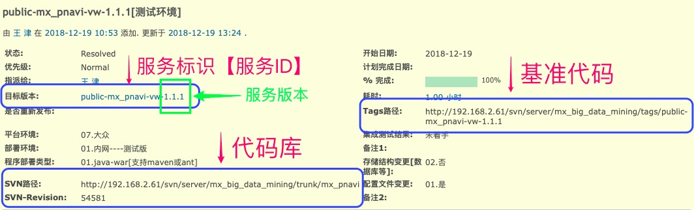
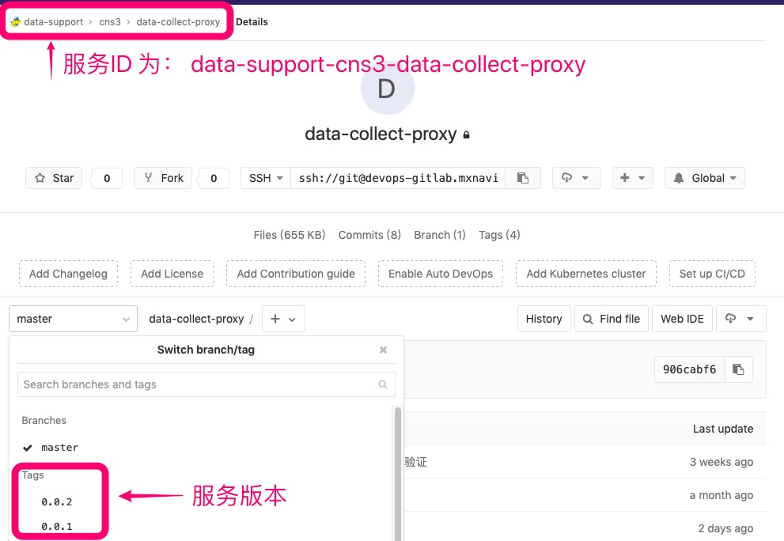

## 一、代码库、基准代码、服务ID、服务版本

### 代码库：

被如SVN、Git等版本控制器管理的代码结构可称为**代码库**，如：http://192.168.2.61/svn/server/mx_big_data_mining/trunk/mx_pnavi 是 mx_pnavi 的**代码库**

**注意&建议：**
* 如果你的代码库想平台化，命名建议面向功能设计，不建议包含: **T10**、**Mazda**等项目名称
* 🚫 代码库仅标识代码存放的位置，不能用于标识线上服务

----

### 基准代码

**基准代码** 需要遵守以下规则：

1. 控制系统：SVN、Git 这种版本控制系统中的这一份代码库；

2. 基准代码需要和应用之间总是保持一一对应的关系，如下图：

    

**说明：**
* 一旦有多个基准代码，就不能称为一个应用，而是一个分布式系统。分布式系统中的每一个组件都是一个应用，每一个应用可以分别使用 12-Factor 进行开发。

* 多个应用共享一份基准代码是有悖于 12-Factor 原则的。解决方案是将共享的代码拆分为独立的类库，然后使用 依赖管理 策略去加载它们。

尽管每个应用只对应一份基准代码，但可以同时存在多份部署。每份 部署 相当于运行了一个应用的实例。通常会有一个生产环境「PRO」，预发布环境「UAT」，联调环境「FAT」。此外，每个开发人员都会在自己本地环境运行一个应用实例，即：开发环境「DEV」，这些都相当于一份部署。

所有部署的基准代码相同，但每份部署可以使用其不同的版本。比如，开发人员可能有一些提交还没有同步至预发布环境；预发布环境也有一些提交没有同步至生产环境。但它们都共享一份基准代码，我们就认为它们只是相同应用的不同部署而已。
  
**【微服务十二要素详情，与项目体制公司定义会略有差别】**

[微服务十二要素](http://12factor.project.mxnavi.com/zh_cn/codebase)

[微服务十二要素 - 备用地址](https://12factor.net/zh_cn/codebase)

----

### 服务ID、服务标识、服务

**服务标识**【简称：**服务ID**、**服务**，下文使用 **服务ID** 代替】，遵守以下规则：

1. 名称需简单明了的表达服务特性，总长度建议小于：53 个字符（只包含小写字母、数字、“-”[英文中横线]【 ⚠️ “_” [英文下横线] 也支持，但不建议使用 】），如果大于53个字符，请考虑使用 英文数字简写规则，如下：

   1）data-support-cns3-data-collect-proxy 【数据运维组-cns3项目-数据收集】
   
   2）public-mx_traffic_searcher-mazda-emg_plamgo_fusion_v3 如果命名过长，可以将与中组别、项目无关部分：p5-mx_traffic_searcher-m4-emg18_v3
   
1. 不仅仅用于标识各类环境中的服务；同时也用于中间件资源的命名，如：data-support-cns3-data-collect-proxy 需要使用Mysql数据库，那么所有部署环境中的数据库名字为：data_support_cns3_data_collect_proxy 【mysql不支持中横线】，更多资源命名规则请参照：[根据服务ID命名资源名称](resources_name_rule.md)

2. 服务ID 与 基准代码 必须保证一一对应，不得存在一对多，多对一关系，命名应直接反应基准代码实际情况。

3. 各位同学沟通时，推荐使用服务ID、基准代码库作为标识；例如：
  1. 测试环境上的 public-mx_fm-mazda 不好用了，返回 50X 
  2. GitLab上的：http://devops-gitlab.mxnavi.com/data-support/cns3/data-collect-proxy 基准代码 测试环境 不好用了，访问超时

***GitLab中使用多级目录管理的基准代码，服务ID长度可以不受 53个字符限制，但请适当控制长度，以免资源命名时受到限制***

----

### 服务版本

**服务版本**，服务ID的版本号，命名规则：**主版本号.子版本号.修正版本号**，需遵循以下特性：
1. 主版本号.子版本号.修正版本号 均有正整数组成
2. 主版本号：接口改动较大，可能无法向后兼容（要看具体项目）
3. 子版本号：增加了新功能，向后兼容
4. 修正版本号：修复 BUG 或优化代码，一般没有添加新功能，向后兼容
5. 🚫 禁止通过发布版本的方式调试代码
6. 🚫 版本一旦发布不得删除、不得重发覆盖

**服务版本命名Demo：** 0.1.0、2.14.0、3.5.11

服务版本将用于 ServiceMesh 灰度、金丝雀等发布策略，详见：[TODO：如何使用ServiceMesh进行灰度、金丝雀发布](TODO)

----

### 系统中的 代码库、基准代码、服务ID、服务版本：

**在 运维机器人 中：**

**在 GitLab 中：**

由于Git版本控制器的天生优势和GitLab Fork功能，代码库与基准代码可以合二为一共同管理

----

### 常见问题：

* **SVN路径：http://192.168.2.61/svn/server/mx_big_data_mining/trunk/mx_pnavi ，是否是一个基准代码？**

  答：**mx_pnavi 不是基准代码**，SVN代码库中的 mx_pnavi 在部署环境上分别为 **Mazda**、**T平台**、**大众cns3** 多个项目部署了实例，违反**多个应用共享一份基准代码**原则，**mx_pnavi** 只能称为**代码库**，而非**基准代码**，实际基准代码为：运维机器人任务中的 **Tags路径**
  
* **当我们需要部署 N 套采样环境时怎么办？**

  答：根据基准代码、服务ID定义，原则上需要建立 N 个服务ID，但如果采样环境具备以下特性：
  * N 套采样环境服务版本相同，服务迭代版本同步
  * N 套采样环境配置文件相同，配置迭代同步
  * N 套采样环境加载地理数据完全相同，数据迭代版本同步

  上线采样环境时可以只创建一个服务ID和基准代码，**🚫但不得与非采样环境共用服务ID和基准代码**