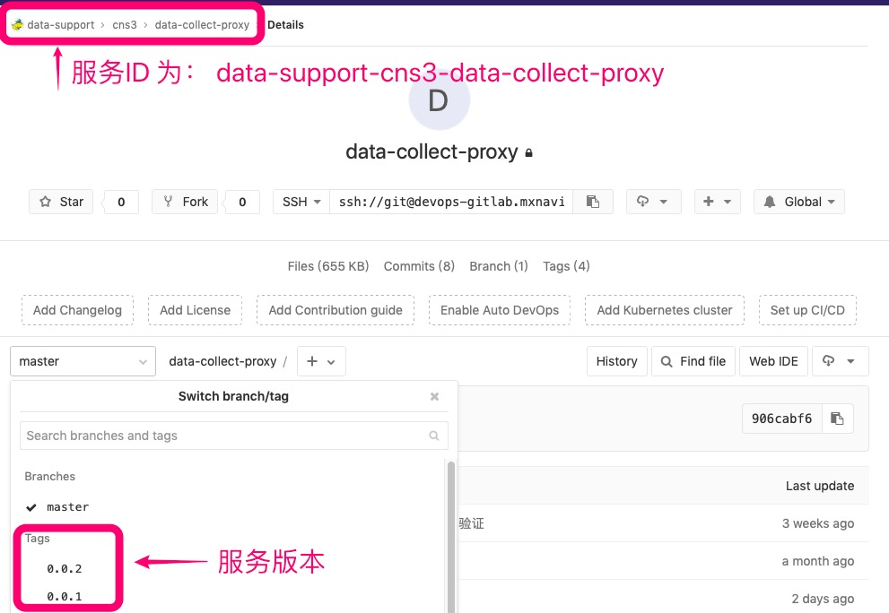

## 部署环境命名规则

### Kubernetes 上的命名规则

例如下图

* 其中 data-support/cns3 命名为 namespace： data-support-cns3

* deployment 或者 StatefulSets 的名字可以有以下规则：
  * data-collect-proxy
  * data-collect-proxy-0.0.2  #可用于ServiceMesh支持灰度、金丝雀升级

* Service 名称： data-collect-proxy ，Service名称用于服务之间相互访问，不得与版本信息相关

* Ingress 名称： data-collect-proxy.data-support-cns3.k8s-project.mxnavi.com 【其中 k8s-project 为 k8s 名称，沈阳机房、铜牛机房、阿里云机房都会有不同的名字】 

### Marathon 上的命名规则 //TODO