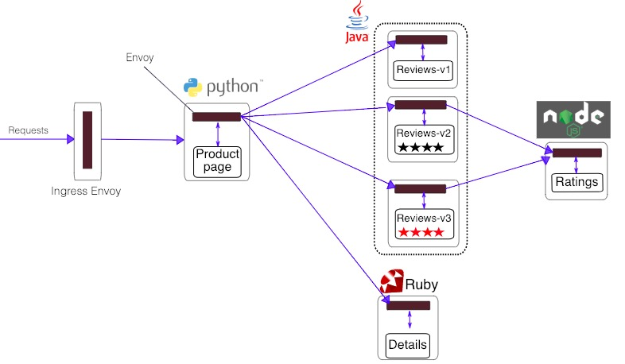
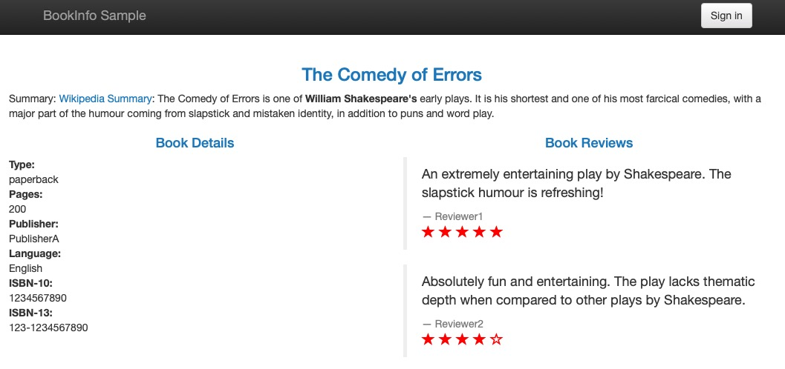

## Istio 使用样例 BookInfo

### 部署应用

要在 Istio 中运行这一应用，无需对应用自身做出任何改变。我们只要简单的在 Istio 环境中对服务进行配置和运行，具体一点说就是把 Envoy sidecar 注入到每个服务之中。这个过程所需的具体命令和配置方法由运行时环境决定，而部署结果较为一致，如下图所示：



所有的微服务都和 Envoy sidecar 集成在一起，被集成服务所有的出入流量都被 sidecar 所劫持，这样就为外部控制准备了所需的 Hook，然后就可以利用 Istio 控制平面为应用提供服务路由、遥测数据收集以及策略实施等功能。

接下来可以根据 Istio 的运行环境，按照下面的讲解完成应用的部署。

### 定义变量

变量：**{namespace}** 在Kubernetes申请到的空间名

### 运行应用

* 创建 BookInfo 所有应用

  ⚠️ 注意替换 {namespace} 成 实验环境的namespace名字
  
  ```kubectl apply -n {namespace} -f https://raw.githubusercontent.com/mxnavi/devops-study/master/04-service-mesh-istio/mxnavi-istio-yaml/bookinfo/samples/bookinfo/platform/kube/bookinfo.yaml ```
  
* 创建 ingress ，让我们可以访问到该应用：

  ⚠️ 注意需要替换文件和命令 {namespace} 
    
  编写文件内容：
  
  vim ingress.yaml
    
  ```yaml
  apiVersion: extensions/v1beta1
  kind: Ingress
  metadata:
      name: bootinfo
  spec:
      rules:
      - host: bookinfo.{namespace}.k8s-project.mxnavi.com
        http:
          paths:
          - backend:
              serviceName: productpage
              servicePort: 9080
  ```
  
  随后执行：
  ```
  kubectl apply -n {namespace} -f ingress.yaml
  ```
  
* 访问地址：
  
  ⚠️ 注意修改 {namespace} 为空间名称
  
  ```
  http://bookinfo.{namespace}.k8s-project.mxnavi.com/productpage
  ```  
  
页面显示如下【可以多刷新几次】，可以发现Bookview部分评分显示有所不同

*注意：该特性为K8S自带的轮询策略，暂时与Istio无关，我们再[下一节](istio-book-info-demo-traffic-management.md)讨论如何使用Istio控制流量




🚫 删除可以通过以下命令：
```
kubectl delete -n {namespace} ingress bootinfo
kubectl delete -n {namespace} -f https://raw.githubusercontent.com/mxnavi/devops-study/master/04-service-mesh-istio/mxnavi-istio-yaml/bookinfo/samples/bookinfo/platform/kube/bookinfo.yaml
```


### [下一节 流量控制](istio-book-info-demo-traffic-management.md)