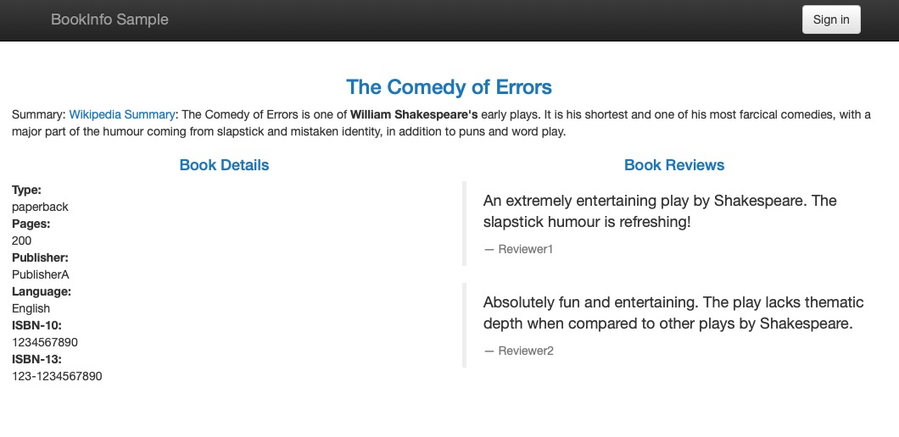
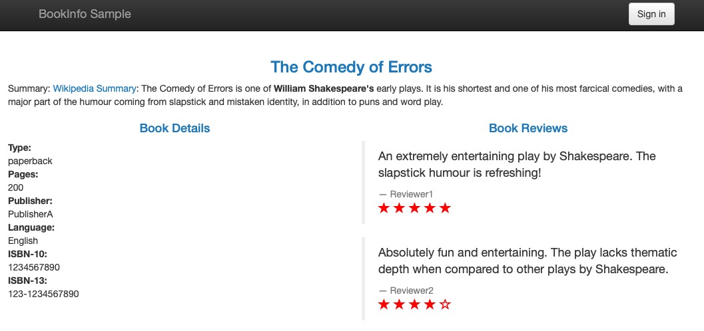

## Istio 使用样例 BookInfo

### 流量控制

上一节我们创建了BookInfo应用，并可以通过浏览器进行访问；

### Istio 接手 reviews 流量
  
  ```kubectl apply -f https://raw.githubusercontent.com/mxnavi/devops-study/master/04-service-mesh-istio/mxnavi-istio-yaml/bookinfo/mxnavi-demo-istio/bookinfo/bookinfo-reviews-all-version.yaml```
  
  Istio 仅仅接手 reviews （显示打分星）的流量，功能上与Kubernetes的Service一致，轮询分发到 reviews v1 - v3 服务上


### 控制流量，基于版本的路由

* 将所有流量转发到 reviews v1 上:

  ```
kubectl apply -f https://raw.githubusercontent.com/mxnavi/devops-study/master/04-service-mesh-istio/mxnavi-istio-yaml/bookinfo/mxnavi-demo-istio/bookinfo/bookinfo-all-to-v1.yaml
  ```
  
  查看页面，所有的reviews不再显示 打分星
  
  


* 将所有流量转发到 reviews v2 上:

  ```
  kubectl apply -f https://raw.githubusercontent.com/mxnavi/devops-study/master/04-service-mesh-istio/mxnavi-istio-yaml/bookinfo/mxnavi-demo-istio/bookinfo/bookinfo-all-to-v2.yaml
  ```
  查看页面，所有的reviews显示 黑色打分星
  
  
  
  
* 将所有流量转发到 reviews v3 上：

  ```
  kubectl apply -f https://raw.githubusercontent.com/mxnavi/devops-study/master/04-service-mesh-istio/mxnavi-istio-yaml/bookinfo/mxnavi-demo-istio/bookinfo/bookinfo-all-to-v3.yaml
  ```
  
  查看页面，所有的reviews显示 红色打分星
  
  
  
  
* 将流量 50% 转发到 v1 、 50% 转发到 v3 [根据权重分配流量]

  ```
  kubectl apply -f https://raw.githubusercontent.com/mxnavi/devops-study/master/04-service-mesh-istio/mxnavi-istio-yaml/bookinfo/samples/bookinfo/networking/virtual-service-reviews-50-v3.yaml
  ```
  
### 控制流量，基于内容的路由

背景：原有系统仅仅提供没有打分星的v1版本，我们刚刚上线了具有打分星的v2版本；该版本在测试用户 jason 验证过后才可以对正式用户开放

* 仅控制 jason 用户访问v2版本
  
  ```
  kubectl apply -f https://raw.githubusercontent.com/mxnavi/devops-study/master/04-service-mesh-istio/mxnavi-istio-yaml/bookinfo/mxnavi-demo-istio/bookinfo/bookinfo-jason-to-v2-other-to-v1.yaml
  ```
  
  **点击页面右上角 Sign in ， 用户名：jason ，密码随意**
  
  
  
  **登录后，页面只会访问到 v2 黑色打分，右上角点击 sign out 登出**
  
  
  
**基于内容的路由原理：**

Istio 可以基于 Http1.1 的 Header 内容 和 Http2 的 Header 内容进行路由转发，我们设计程序时，可以在Header中预留一些埋点

### 故障注入，使用 HTTP 延迟进行故障注入

为了测试我们的微服务应用程序 Bookinfo 的弹性，我们将在 reviews :v2 和 ratings 服务之间的一个用户 “jason” 注入一个 7 秒 的延迟。 由于 reviews:v2 服务对其 ratings 服务的调用具有 10 秒的硬编码连接超时，因此我们期望端到端流程是正常的（没有任何错误）。

* 创建故障注入规则以延迟来自用户 “jason”（我们的测试用户）的流量[ 规则可能需要几秒钟才能传播到所有的pod ]

  ```
kubectl apply -f https://raw.githubusercontent.com/mxnavi/devops-study/master/04-service-mesh-istio/mxnavi-istio-yaml/bookinfo/samples/bookinfo/networking/virtual-service-ratings-test-delay.yaml
  ```

* 观察应用程序行为

  以 “jason” 用户身份登录。如果应用程序的首页设置为正确处理延迟，我们预计它将在大约 7 秒内加载。 要查看网页响应时间，请在IE，Chrome 或 Firefox 中打开 Developer Tools 菜单（通常，组合键 Ctrl+Shift+I 或 Alt+Cmd+I ）， 选项卡 Network，然后重新加载 productpage 网页 。

  您将看到网页加载大约 6 秒钟。评论部分将显示 对不起，此书的产品评论目前不可用 。
  
  
  
  
* 了解发生了什么

  整个评论服务失败的原因是我们的 Bookinfo 应用程序有错误。 产品页面和评论服务之间的超时（评分为 3 次+ 1 次重试 = 总共 6 次）比评论和评级服务之间的超时时间（硬编码连接超时为 10 秒）。 这些类型的错误可能发生在典型的企业应用程序中，其中不同的团队独立地开发不同的微服务。 Istio 的故障注入规则可帮助您识别此类异常，而不会影响最终用户。
  
* 修复错误
  
  此时我们通常会通过增加产品页面超时或减少评级服务超时的评论来解决问题， 终止并重启固定的微服务，然后确认 productpage 返回其响应, 没有任何错误。


### 故障注入，使用 HTTP Abort 进行故障注入  

作为弹性的另一个测试，我们将在 ratings 服务中，给用户 jason 的调用加上一个 HTTP 中断 。 我们希望页面能够立即加载，而不像延迟示例那样显示”产品评级不可用”消息。

* 为用户 “jason” 创建故障注入规则发送 HTTP 中止
  
  ```
  kubectl apply -f https://raw.githubusercontent.com/mxnavi/devops-study/master/04-service-mesh-istio/mxnavi-istio-yaml/bookinfo/samples/bookinfo/networking/virtual-service-ratings-test-abort.yaml
  ```


  
  

* 观察应用程序行为
  
  以 “jason” 用户名登录, 应该能立即看到页面加载”产品评级不可用”消息。 从用户 “jason” 注销，您应该会在产品页面网页上看到评级星标的评论成功显示。


### 金丝雀发布

Istio流量控制结合Kubernetes HPA 功能可以做到金丝雀发布，[查看详情](https://istio.io/blog/2017/0.1-canary/)


### [下一节 BookInfo配置清理](istio-book-info-demo-clean.md)