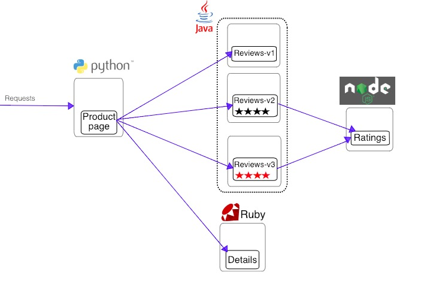
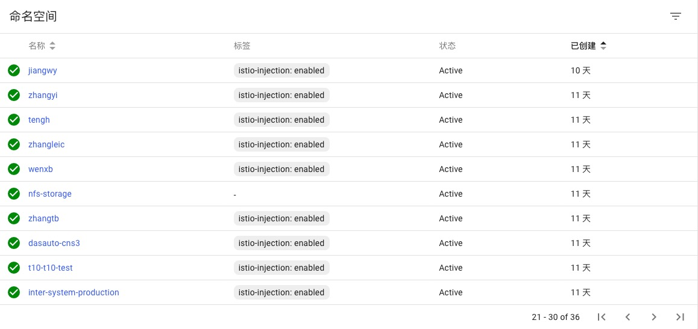

## Istio 使用样例 BookInfo

### 应用介绍

部署一个样例应用，它由四个单独的微服务构成，用来演示多种 Istio 特性。这个应用模仿在线书店的一个分类，显示一本书的信息。页面上会显示一本书的描述，书籍的细节（ISBN、页数等），以及关于这本书的一些评论。

Bookinfo 应用分为四个单独的微服务：

* productpage ：productpage 微服务会调用 details 和 reviews 两个微服务，用来生成页面。
* details ：这个微服务包含了书籍的信息。
* reviews ：这个微服务包含了书籍相关的评论。它还会调用 ratings 微服务。
* ratings ：ratings 微服务中包含了由书籍评价组成的评级信息。

reviews 微服务有 3 个版本：

* v1 版本不会调用 ratings 服务。
* v2 版本会调用 ratings 服务，并使用 1 到 5 个黑色星形图标来显示评分信息。
* v3 版本会调用 ratings 服务，并使用 1 到 5 个红色星形图标来显示评分信息。

服务调用图如下：



Bookinfo 是一个异构应用，几个微服务是由不同的语言编写的。这些服务对 Istio 并无依赖，但是构成了一个有代表性的服务网格的例子：它由多个服务、多个语言构成，并且 reviews 服务具有多个版本。


### 开始之前--Istio自动注入功能检查

运行BookInfo样例需要一个支持Istio自动注入的Namespace命名空间，请检查Namespace命名空间 是否具有 ``` istio-injection: enabled ``` label 标签，如果没有请联系Kubernetes管理员修改

⚠️ 如果namespace已经存在部署，增加标签后，部署重启也会携带Istio相关功能



### [下一节 部署应用](istio-book-info-demo-apply-app.md)