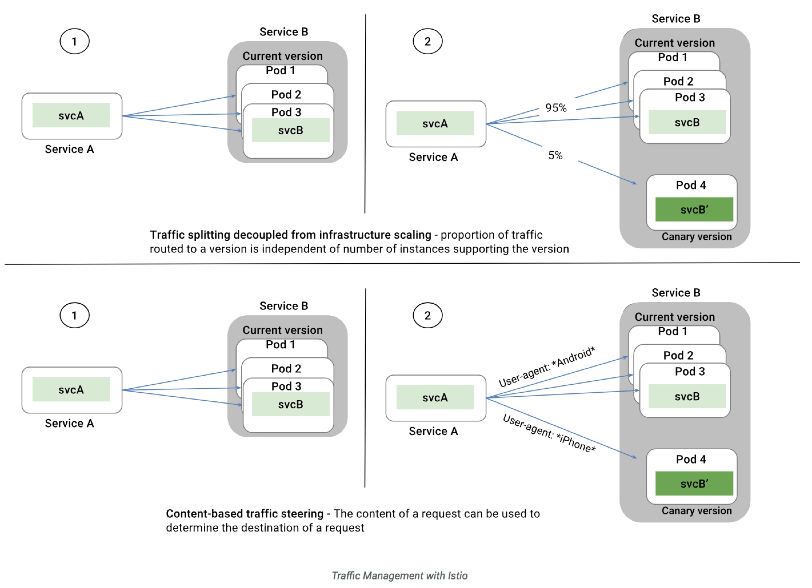

## Service Mesh & Istio 介绍：

### SideCar 边车模式

Service Mesh 直译过来是 服务网格，目的是解决系统架构微服务化后的服务间通信和治理问题。服务网格由 sidecar 节点组成。在介绍 service mesh 之前，我们先来看一下什么是 sidecar.

Sidecar 在软件系统架构中特指边车模式。这个模式的灵感来源于我们生活中的边三轮：即在两轮摩托车的旁边添加一个边车的方式扩展现有的服务和功能。

这个模式的精髓在于实现了数据面（业务逻辑）和控制面的解耦：原来两轮摩托车的驾驶者集中注意力跑赛道，边车上的领航员专注周围信息和地图，专注导航。

### SideCar & ServiceMesh

具体到微服务架构中，即给每一个微服务实例（也可以是每个宿主机host）同步部署一个 sidecar proxy

该 sidecar proxy 负责接管对应服务的入流量和出流量。并将微服务架构中以前有公共库、framework实现的熔断、限流、降级、服务发现、调用链分布式跟踪以及立体监控等功能从服务中抽离到该 proxy 中

当该 sidecar 在微服务中大量部署时，这些 sidecar 节点自然就形成了一个网格：

这就是我们说的 service mesh 了。对 service mesh 有了一个感性认识后，我们看一下 Linkerd 和 Conduit 的作者 William Morgan 在What’s a service mesh? And why do I need one? 中是如何诠释什么是 Service Mesh:

Service Mesh 这个服务网络专注于处理服务和服务间的通讯。其主要负责构造一个稳定可靠的服务通讯的基础设施，并让整个架构更为的先进和 Cloud Native。在工程中，Service Mesh 基本来说是一组轻量级的与应用逻辑服务部署在一起的服务代理，并且对于应用服务是透明的。

###ServiceMesh 特点

* 是一个基础设施
* 轻量级网络代理，应用程序间通讯的中间层
* 应用程序无感知，对应用程序透明无侵入
* 解耦应用程序的重试/超时、监控、追踪和服务发现等控制层面的东西

###ServiceMesh 发展

Service Mesh 的概念从2016年提出至今，已经发展到了第二代。

第一代 service mesh 以 Linkerd 和 Envoy 为代表。

Linkerd 使用Scala编写，是业界第一个开源的service mesh方案。作者 William Morgan 是 service mesh 的布道师和践行者。Envoy 基于C++ 11编写，无论是理论上还是实际上，后者性能都比 Linkderd 更好。这两个开源实现都是以 sidecar 为核心，绝大部分关注点都是如何做好proxy，并完成一些通用控制面的功能。 但是，当你在容器中大量部署 sidecar 以后，如何管理和控制这些 sidecar 本身就是一个不小的挑战。于是，第二代 Service Mesh 应运而生。

第二代service mesh主要改进集中在更加强大的控制面功能（与之对应的 sidecar proxy 被称之为数据面），典型代表有 Istio 和 Conduit。

###ISTIO 解析

Istio 是 Google 和 IBM 两位巨人联合 Lyft 的合作开源项目。是当前最主流的service mesh方案，也是事实上的第二代 service mesh 标准。

Google 和 IBM 之所以要带上小弟 Lyft 一起玩耍是因为他们不想从头开始做数据面的组件，于是在 Istio 中，直接把 Lyft 家的 Envoy 拿来做 sidecar. 除了sidecar, Istio中的控制面组件都是使用Go编写。Istio架构如下图所示：

对于一个仅提供服务与服务之间连接功能的基础设施来说，Istio的架构算不上简单。但是架构中的各个组件的理念的确非常先进和超前。

* Envoy: 扮演sidecar的功能，协调服务网格中所有服务的出入站流量，并提供服务发现、负载均衡、限流熔断等能力，还可以收集大量与流量相关的性能指标。

* Pilot: 负责部署在service mesh中的Envoy实例的生命周期管理。本质上是负责流量管理和控制，是将流量和基础设施扩展解耦，这是Istio的核心。感性上，可以把Pilot看做是管理sidecar的sidecar, 但是这个特殊的sidacar并不承载任何业务流量。Pilot让运维人员通过Pilot指定它们希望流量遵循什么规则，而不是哪些特定的pod/VM应该接收流量。有了 Pilot 这个组件，我们可以非常容易的实现 A/B 测试和金丝雀Canary测试：

* Mixer: Mixer在应用程序代码和基础架构后端之间提供通用中介层。它的设计将策略决策移出应用层，用运维人员能够控制的配置取而代之。应用程序代码不再将应用程序代码与特定后端集成在一起，而是与Mixer进行相当简单的集成，然后Mixer负责与后端系统连接。也就是说，Mixer可以认为是其他后端基础设施（如数据库、监控、日志、配额等）的sidecar proxy:

* Istio-Auth: 提供强大的服务间认证和终端用户认证，使用交互TLS，内置身份和证书管理。可以升级服务网格中的未加密流量，并为运维人员提供基于服务身份而不是网络控制来执行策略的能力。Istio的未来版本将增加细粒度的访问控制和审计，以使用各种访问控制机制（包括基于属性和角色的访问控制以及授权钩子）来控制和监视访问您的服务，API或资源的人员。

参考文章：
https://www.jianshu.com/p/e23e3e74538e
http://www.importnew.com/28798.html
